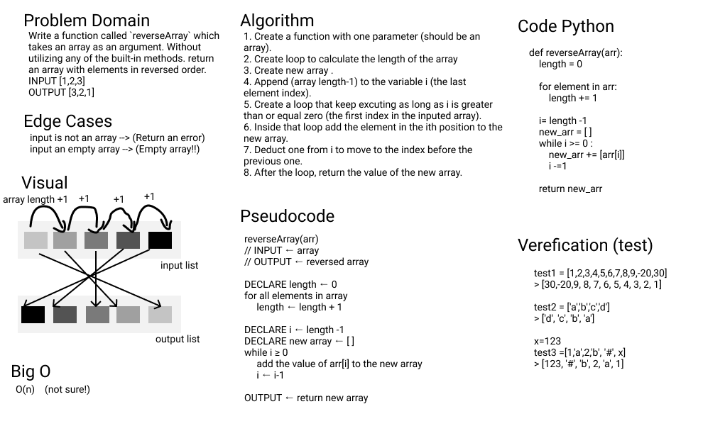

# Array Reverse

In this challenge, I have to create a function that reverses the input array without using the methods that come with the standard library of Python, which means I cant use: `arr.reverse()`

This is the first time I deal with the whiteboard test. This method is really good and makes you take the best decision and know almost everything about your function before you start coding it. But I think I need more reading to understand BigO, the time wasn't enough for that. BigO is very powerful to make your function fast and not a resources consumer.

