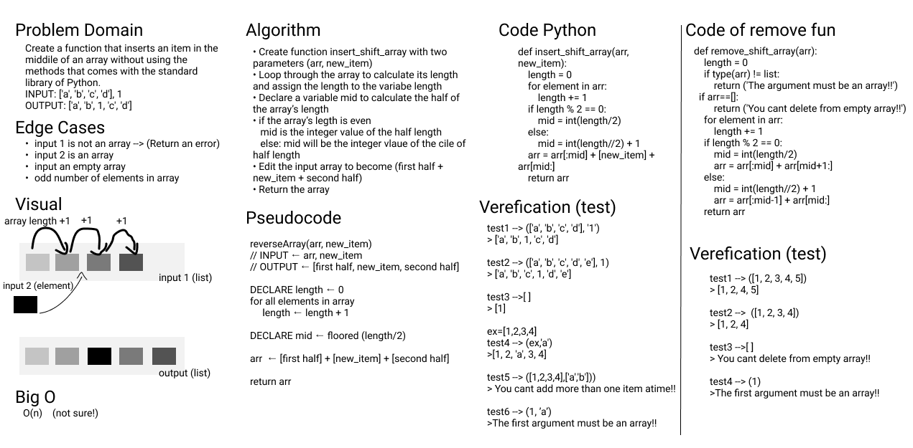

# Array Insert and Shift

In this challenge, I have to create a function that inserts an item in the middile of an array without using the methods that comes with the standard library of Python. 

I still didint read about BigO to calculate space and time complixity. However I tried to use the minimu ampunt of storage and kept away from nested loops.