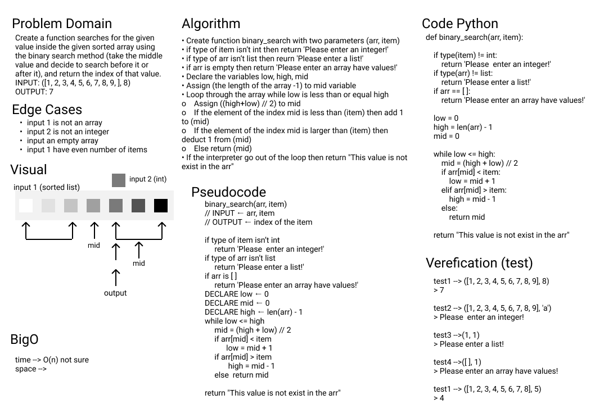

# Array Binary Search

This function searches for the given value inside the given sorted array using the binary search method (take the middle value and decide to search before it or after it), and return the index of that value.

 

 

I dident read about BigO yet