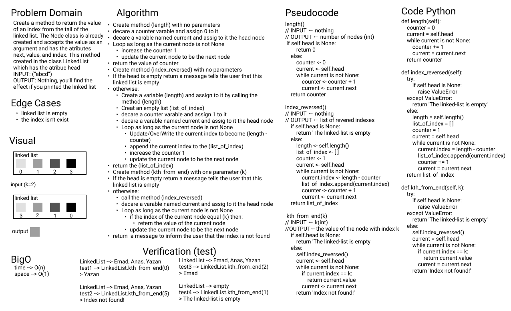

# Linked List

**Author:** Emad Almajdalawi

**Date:** 20/03/2022

**Application Vesrsion:** 0.4.0

**Python Verstion:** 3.9.5

## Overview:

This application creates a linked list, which is a list of nodes, each node has a value and a pointer to the next node if exists. The benefit of this over ordinary list is the freedom in creation location inside the memory.

Singly linked list has three methods:

- `insert`: to add a node to the head of the linked list. The time complexity of it is O(1).

- `append`: to add a node to the end of the linked list. The time complexity of it is O(n).

- `includes`: to search for a node's value in the linked list. The time complexity of it is O(n).

- `insert_after`: to add a node after a specific node. The time complexity of it is O(n).

- `insert_before`: to add a node before a specific node. The time complexity of it is O(n).

- `insert_after`: to remove a node from the linked list. The time complexity of it is O(n).

- `kth_from_end`: A method to return the value of an index from the tail of the linked list.

- `find_mid`: A method to find the middle node in the linked list.

- `__len__`:  A method to canculate the length of the linked list.

- `reverse`: A method to reverse the linked list

- `palindrome`: A method to check if the linked list is symitric or not

 Doubly linked list has one method, which is `insert` to add a node to the head of the linked list. The time complexity of it is O(1).

 You can merge two singly liked lists by `merge_linked_list` function. time complexity is O(n), space complexity is O(1).

  

 This application has been created as a solution to the code challenge 5. You can test the file by running (pytest), I recommend you install (poetry) package before that.

 

# WhiteBoards

## append

 

## insret_after

 

## insret_before

 

## kth_from_end

 

## merge_linked_list

 

## reverse

 

# Github

PR: https://github.com/e97m/data-structures-and-algorithms/pull/19
