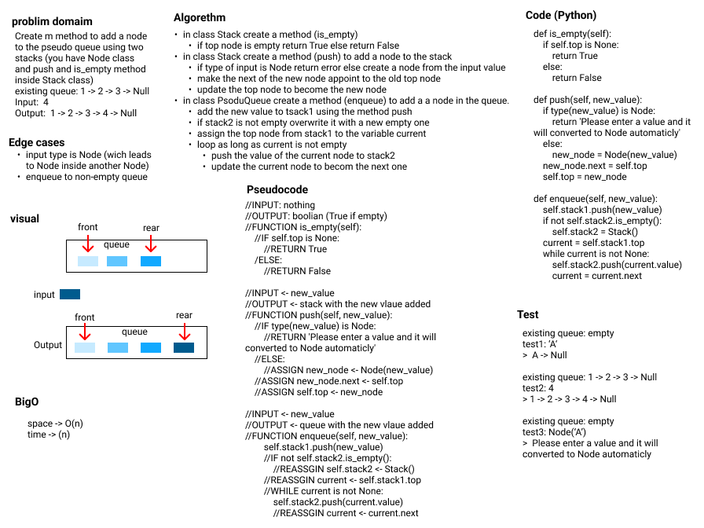
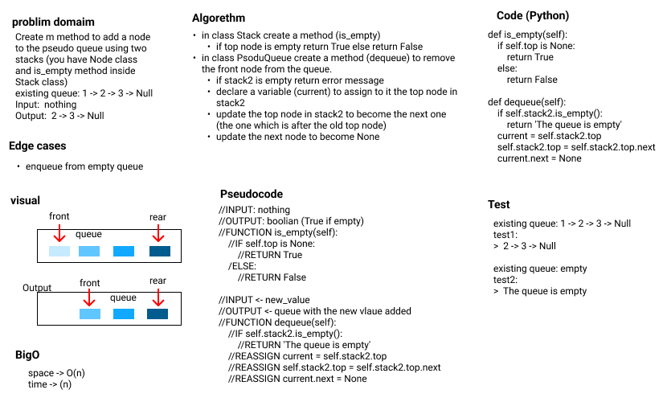
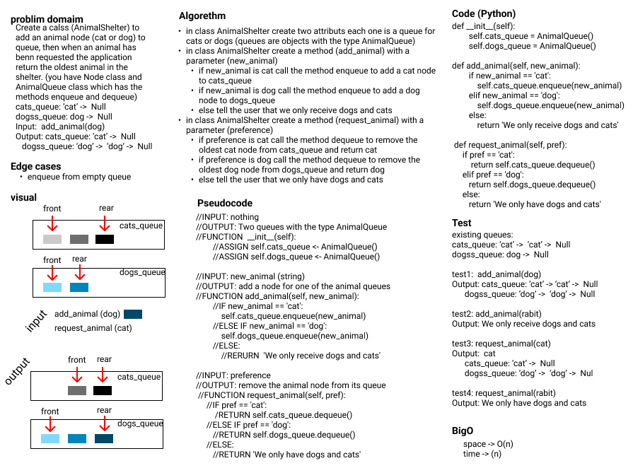

# Stacks and Queues

**Author:** Emad Almajdalawi

**Date:** 30/03/2022

**Application Vesrsion:** 0.3.0

**Python Verstion:** 3.9.5

**poetry Vesrsion:** 1.1.13

## Overview:
This application creates stacks and queues, and let you modify them using stack_and_aueue.py file. And in animal_shelter.py file it ctreats a queue for dos and another for cats, then dequeue the oldest animal if it is requwsted.

 

Methods for stack in this application:

- `push`: A method to add a node to the stack
- `pop`: A method to remove a node from the stack
- `peek`: A method to show the top of the stack
- `is_empty`: A method to check if the stack is empty or not

 

Methods for queue in this application:

- `enqueue`: A method to add a node to the queue
- `dequeue`:  A method to remove a node from the queue
- `peek`: A method to show the top of the queue
- `is_empty`: A method to check if the queue is empty or not

 

Methods for Pseudo Queue in this application:

- `enqueue`: A method to add a node to the pseudo queue using two stacks
- `dequeue`:  A method to remove a node from the pseudo queue

 

Methods for AnimalShelter:

- `add_animal`: A method to deside where to enqueue the new animal (dog queue or cat queue)
- `remove_animal`:  A method to deside from where to dequeue the recuested anomal (dog queue or cat queue)

 

# WhiteBoards

## PseudoQueue enqueue

 

## PseudoQueue dequeue

 

## AnimalShelter

 

## [Github PR](https://github.com/e97m/data-structures-and-algorithms/pull/22)