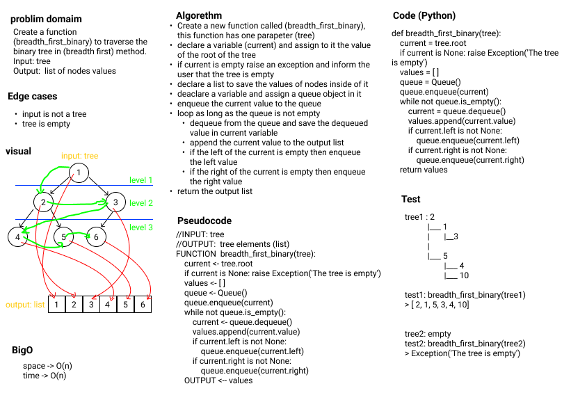

# Trees

**Author:** Emad Almajdalawi

**Date:** 9/5/2022

**Application Vesrsion:** 0.3.0

## Overview:

This is an aplication to create and manipullate trees. You can use this application for binary trees and for k-ary-trees.

 

### Binary Trees:

### `Binarytree`: A class to manipulate the binary tree. It has the following methods:

- `pre_order`, `pre_order_recursive`: A method to traverse the tree elements in post-order. time O(n), space O(n)
- `in_order`, `in_order_recursive`: A method to traverse the tree elements in in-order. time O(n), space O(n)
- `post_order`, `post_order_recursive`: A method to traverse the tree elements in in-order. time O(n), space O(n)
- `maximum_value`: A method to find the max value of a binary tree. time O(n), space O(1)

### `BinarySearchtree`: A class to manipulate the binary tree. it has the following methods:

- `insert`: A method to insert a node to the tree. time O(n), space O(1)
- `find`: A method to find a node in the tree. time O(n), space O(1)
- `max_binary_search`:  A method to find the max value of a binary search tree. time O(n), space O(1)
- `delete_binary_search`: A method to delete a leaf node from the the tree. time O(n), space O(1)

### `breadth_first_binary`: A function to traverse the binary-tree elements (breadthFirst). time O(n), space O(n)

 

### K-Ary-Tree:

### `KAryTree` : A class to manipulate the K-Ary-Tree. It has the following methods:

- `breadth_first_k`: A method to traverse the k-ary-tree elements (breadthFirst). time O(n), space O(n)
- `insert_k`:  A method to create a KNode and insert it under a given parent node. time O(n), space O(1)

### `fizz_buzz_tree`: A method to traverse the k-ary-tree elements (breadthFirst) then return a tree has the value: Fizz if it divisible by 3, Buzz if it divisible by 5, FizzBuzz if it divisible by 3 and 5. time O(n), space O(n)

 

## Whiteboards

### max, max_binary_search

 

### breadth_first_binary

 

### fizz_buzz_tree

 

[GitHub pull request](https://github.com/emad-almajdalawi/data-structures-and-algorithms/pull/30)