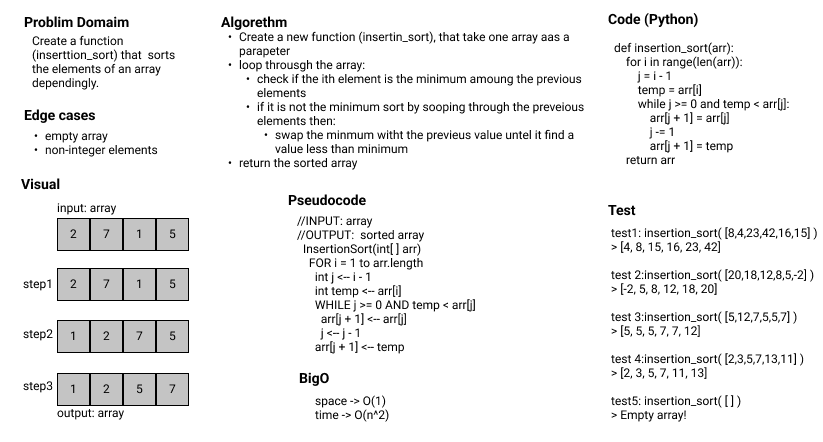

## Insertion Sort

Author: Emad Almajdalawi

Date: 16/5/2022

Application Vesrsion: 0.1.0

Overview:

It is an algorithm that used to sort values of the array decinding. To know how this algorrithm works please [read](./BLOG.md) this blog.

 

## [GitHub pull request](https://github.com/emad-almajdalawi/data-structures-and-algorithms/pull/31)
