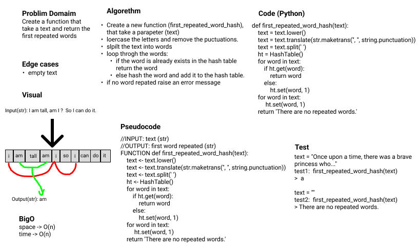
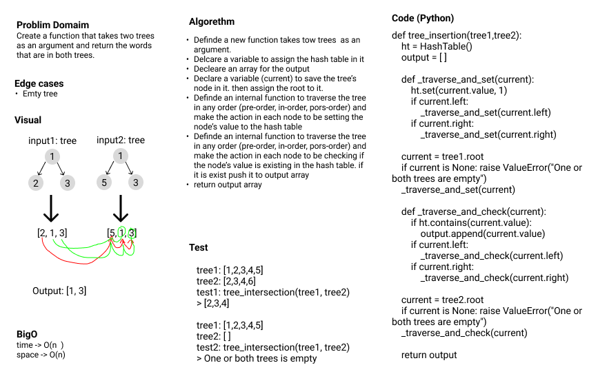
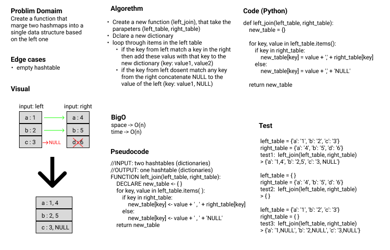

# Hash Table

**Author:** Emad Almajdalawi

**Date:** 29/5/2022

**Application Vesrsion:** 0.4.0

## Overview:

Hash table is a data structure that stores data in key-value pairs. It is used to implement an associative array, a type of dictionary. It is more efficient way than a normal array.

 

This application contains the following inside HashTable calss:

- `hash`: A method to hash the key according to ASCII size. time O(n), space O(1).
- `set`: A method to set the key-value pair. time O(1), space O(1).
- `get`: A method to get the value of the key. time O(1), space O(1).
- `keys`: A method to get all the keys. time O(n), space O(n).
- `contains`: A method to check if the key is in the hash table. time O(1), space O(1).

 

The followinig functions are some applications of hashmap:

- `repeated-word`: A function to find the first repeated word in a string.

- `tree-intersection`: It is an algorithm that used to find the intersection of two arrays usning hash table.

- `left-join`: A function that marge two hashmaps into a single data structure based on the left one. Which means it takes the keys from the left hashmap along with this valus and the valuse of the same key in the righ hashmap if the kys exist there. If the key does not exist in the right hashmap, the value is set to `None`.

 

[GitHub pull request](https://github.com/emad-almajdalawi/data-structures-and-algorithms/pull/40)