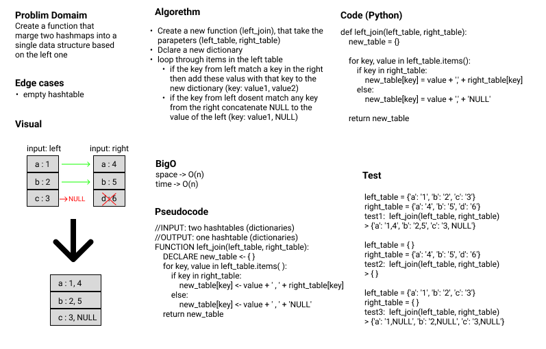

# Hash Table - Left Join

**Author:** Emad Almajdalawi

**Date:** 29/5/2022

**Application Vesrsion:** 0.1.0

## Overview:

A function that marge two hashmaps into a single data structure based on the left one. Which means it takes the keys from the left hashmap along with this valus and the valuse of the same key in the righ hashmap if the kys exist there. If the key does not exist in the right hashmap, the value is set to `None`.

## WhiteBoard

 

[GitHub Pull Request](https://github.com/emad-almajdalawi/data-structures-and-algorithms/pull/37)