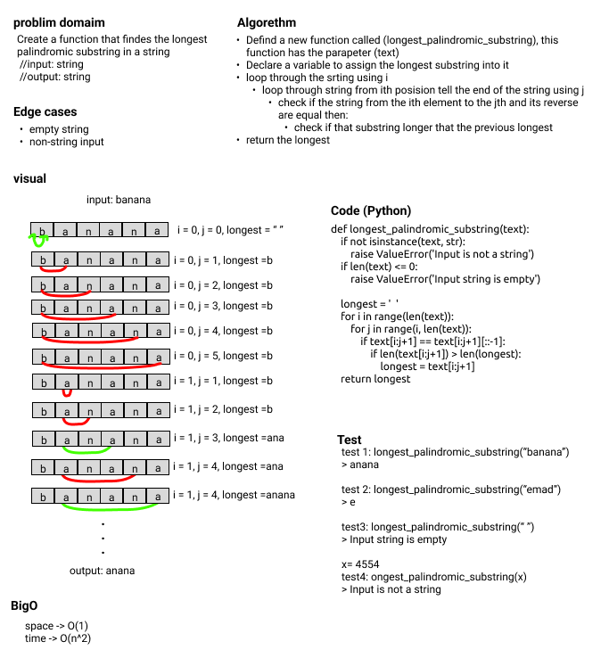
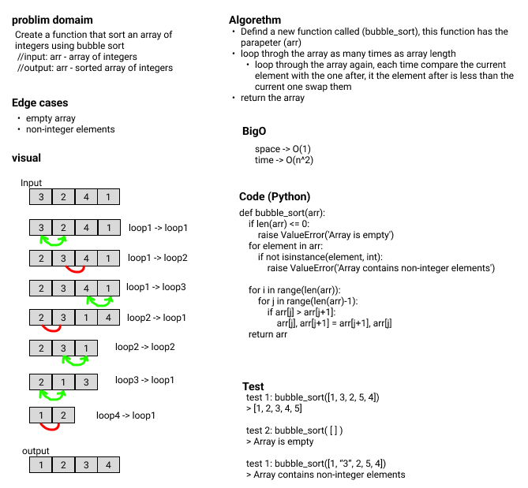
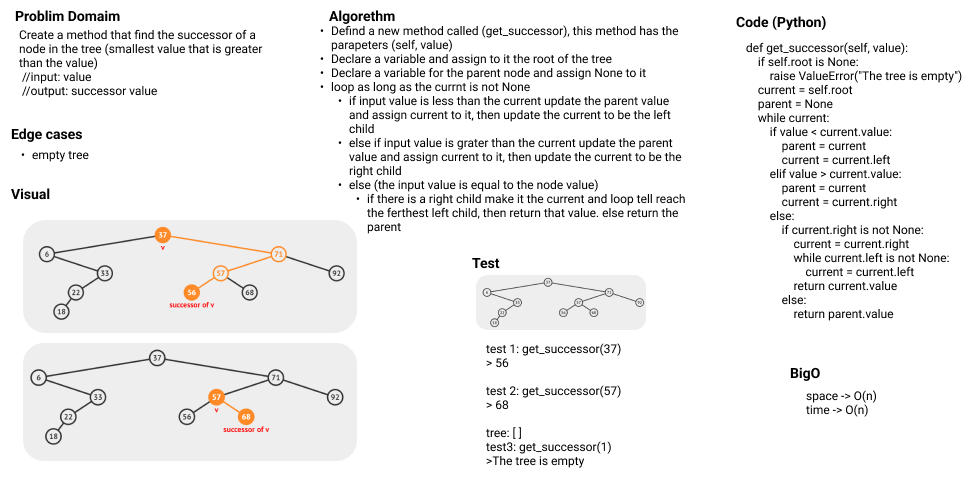

# Random Problems

**Author:** Emad Almajdalawi

**Date:** 6/6/2022

**Application Vesrsion:** 0.1.0

## Overview:

These are the top 10 common topics in interviews for SW dev:

1. Depth First Search
2. Breadth-First Search
3. Matching Parenthesis
4. Making use of Hash Tables
5. Knowing how to manipulate multiple variables/Pointers at once
6. Reversing a linked list
7. Sorting fundamentals  (time complexity, functioning, etc.)
8. Recursion
9. Custom Data structure (ex. suffix tree )
10. Binary Search

 

I selected the following 3 topics:

### Longest Palindromic Substrung (multiple pointers)

 

### Bubble Sort

 

### get_successor (Binarry Search Tree )

[GitHub pull request](https://github.com/emad-almajdalawi/data-structures-and-algorithms/pull/41)